<!-- PROJECT LOGO -->
 

  

  <h1 align="center"> Customer Churn Analysis </h1>

   

# About this project
## Project Overview & Scope

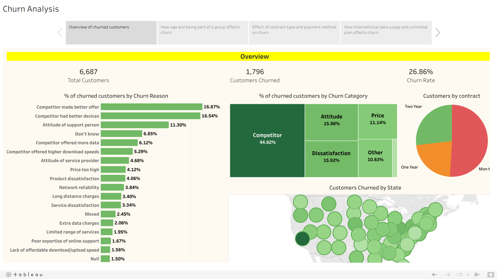

Check out the dashboard published [here](https://public.tableau.com/views/CustomerChurnAnalysis_16874898423310/ChurnAnalysis?:language=en-US&:display_count=n&:origin=viz_share_link).

Customer churn, also known as customer attrition, occurs when individuals opt to discontinue using a company's products or services, resulting in the loss of their customer status. **This issue poses a significant challenge across multiple industries, often leading to surprisingly high average churn rates.** In certain global markets, churn rates can even reach 30% or more. Customer churn is typically assessed by calculating the customer churn rate, which represents the number of customers who ceased their association with the company during a specific period, such as a year, month, or financial quarter.

For this project, I analyzed customer data from a US-based telecom company to identify the reasons behind customer churn and provide recommendations to reduce it. You can access the dataset [here](https://github.com/RohanWaterloo/SQL-Script/blob/main/Customer_Data.csv).

The dataset contains valuable information, including whether a customer churned or not, along with various relevant features related to churn reasons, customer demographics, customer plans, data usage, monthly charges, and more. For a detailed description, please refer to the metadata grids below:

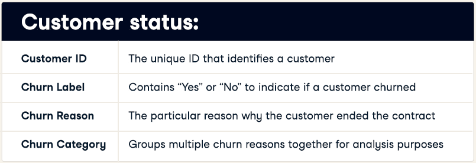

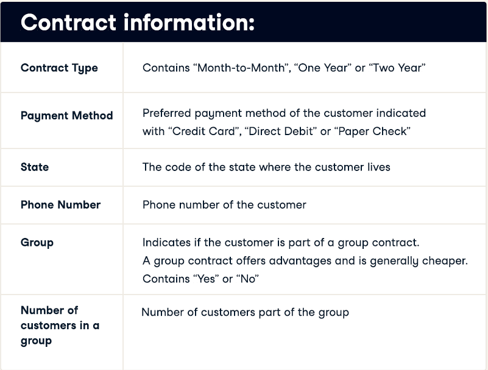

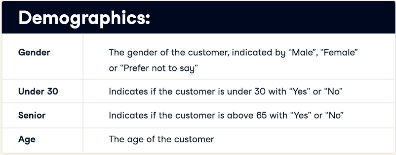

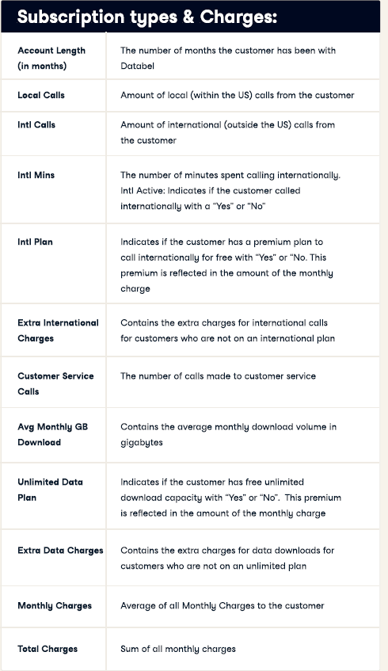

## Exploratory Analysis:

* Overall Churn Rate is approximately 27%
* Almost 45% of customers churn due to reasons related to competitors.
* Churn Rate in California is abnormally high (63.24%)

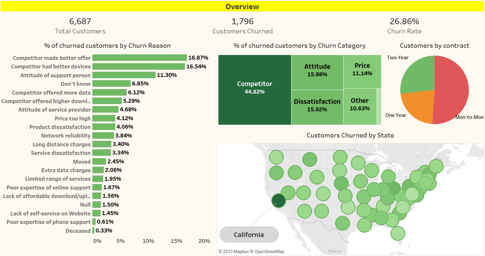

These are some of the initial insights obtained till now using only a handful of attributes I have in the data. **So I need to dive in deeper to explore other data columns as well and check if I can find something relevant while analyzing them.**

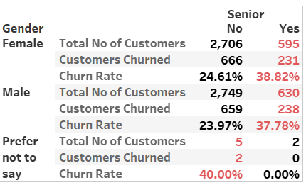

In case of both male and female genders, senior customers have about 11% more churn rate than the average. This is definitely an interesting finding which shall be explored deeply as to why seniors have more churn rate for this telecom company.

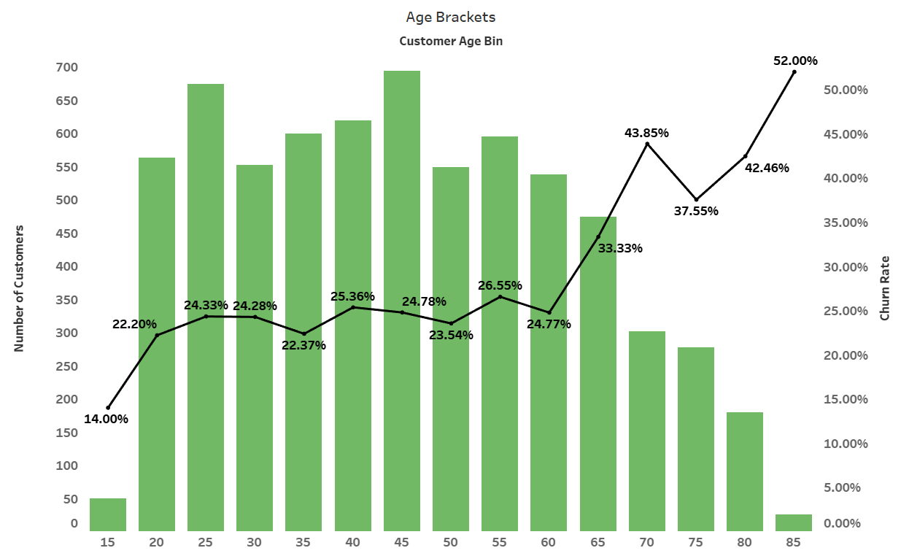

Based on the chart above, one can see that above 60 years, the churn percentage is higher. **But it should also be kept in mind that the number of customers also are less in that age bins.**

## Analysis Based on Group Membership:

Now here is one more interesting point. **The company offers group contracts to customers from same household.** The advantage for the customer is discounted rate and it also lets the company grow their customer base.

So here I have analyzed the average monthly bills for customers who are a part of the group and those who are not and check if they have a low phone bill, which may in turn effect the churn rate.

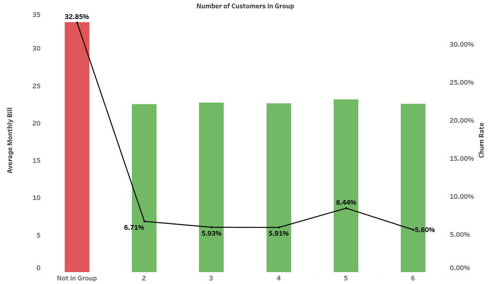

Based on the analysis, the average monthly bill for individual customers is approximately $34, whereas those who are a part of the group have a maximum average of $23, **which is a $11 difference and it is indeed substantial**. It is also clear that the churn rate is higher for those people who are not a part of a group.

Actionable Insight: **The company can direct it’s customer service department to reach out to the customers who have not taken group plan, tell them about family connection plans and explain the possible benefits.**

## Analysis Based On Unlimited Data Plan:

Based on an overall analysis, 32.11% of customers who take an unlimited data plan churn, whereas only 16.1% of those who do not take it churn, **and it seems to be a bit counter-intuitive because if a customer takes unlimited plans then he/she shall be the one who has the intention to stay.**

So, in order to solve this anomaly, I dig deeper and further divide the visualization based on average monthly data used by the customers. Upon doing this, it becomes clear that customers who use less than 5GB of data monthly and have taken the unlimited data plan are more likely to churn.

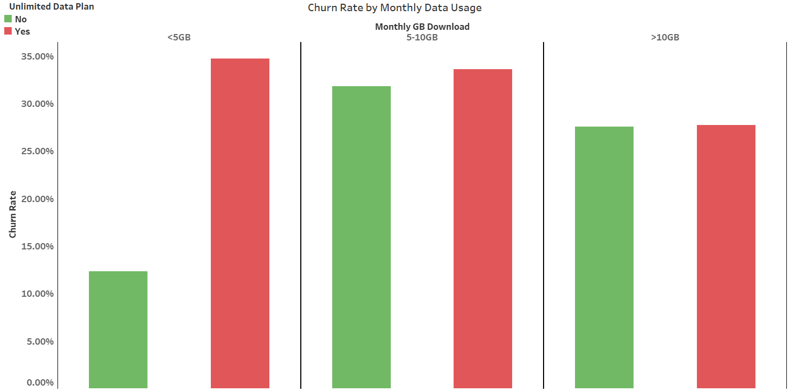

Actionable Insight: **So these customers, who use less than 5GB and have taken unlimited data plan can be contacted and offered with other plans that have a cap on data usage and will be cheaper for them.**

## Analysis Based on International Activity & International Plan:

Initially a text table is created in which rows show if a customer is internationally active or not and column shows if customer has international plan or not. It is observed that customers who are not internationally active and do have an international data plan tend to churn more. So the table is further detailed out in terms of total number of customers, which shows that the group with abnormally high churn rate of 71.19% has less customers as compared to other groups.

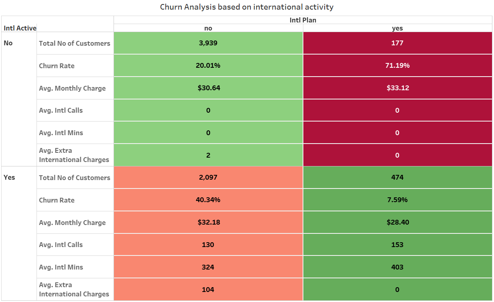

Actionable Insight: **Contact customers who are an on an international plan but have not called internationally and propose them to downgrade their plan.**

But the group which is internationally active and does not have an international plan also has a high churn rate and a substantial number of customers also. On further diving in to this group, the other values like number of international calls, international minutes and extra international charges incurred is also put up in the table. **It is apparent that people who are internationally active, but have not taken international plan seem to have spent a substantial amount of time on international calls and since they do not have an international package they incur high charges.**

Actionable Insight: **Contact these customers and offer them an international package, by telling them about their international calling minutes and explaining the cost reduction for them if they opt for international plans**

## Analysis Based on Other Relevant Factors:

Based on the visual below, it is clear that **customers with month to month contracts are more likely to churn. And on the top of that, customers who do a direct debit payment, of those, 1141 out of 1796 of them are likely to churn, so this should be taken in to consideration by the company executives.**

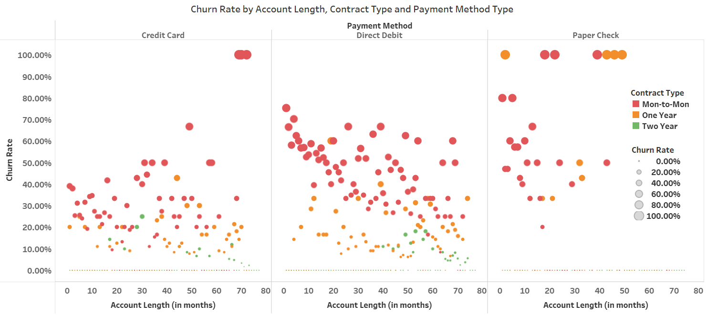

## Some Insights From Overview Dashboard:

3411 of 6687 customers who churned had month to month contracts and majority got offered with some better products or offers from competitors. **The churn rate for this category is 46.29%.**

Actionable Insight: **Since majority of the churn reasons belong to competitors, a thorough benchmarking study of competitor products and services is recommended as without knowing about them, this telecom company can’t actually analyze its own shortcomings on customer’s end.**

## Some Insights From Age Brackets & Groups Dashboard:

**1538 out of 5166 customers who are not a part of group belong to senior citizens.** And around 40% of them are among the churned customers, against an overall churn rate of 33% if we take all age groups into consideration. **1031 out of the 1538 senior citizens prefer direct debit as method of payment and in these customers the churn rate is 45%.**

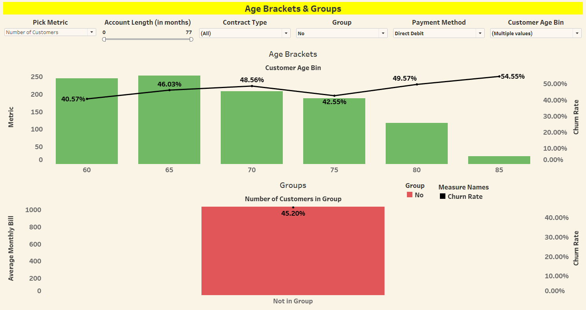

Actionable Insight: **Company shall revise its payment platform especially for direct debit payments. There could be technical issues that customers may be facing, causing them to get frustrated and thus churn away.**

## Some Insights From Payment Method and Contract Type Dashboard:

**Customers doing payment through direct debit also tend to make a lot of customer service calls. So, this further reinforces the points stated in the previous dashboard analysis.**

## Conclusion:

Therefore, based on above analysis, the final recommendations to the company are:

* The company can direct it’s customer service department to reach out to the customers without family connection plans and explain them their benefits.
* Customers who have taken unlimited data plan but have usage of less than 5GB can be contacted and offered with other plans that have a cap on data usage and will be cheaper.
* Contact customers who are an on an international plan but have not called internationally and propose them to downgrade their plan.
* Customers who do not have an international plan but are internationally active can be reached out and offered an international package, by telling them about their international calling minutes and explaining the cost reduction for them if they opt for international plans.
* Since majority of the reasons belong to competitors, a thorough benchmarking study of competitor products and services is recommended as without knowing about them, this telecom company can’t analyze its own shortcomings on customer’s end.
* Company shall revise its payment platform especially for direct debit payments. There could be technical issues that customers may be facing, causing them to get frustrated and thus churn away.